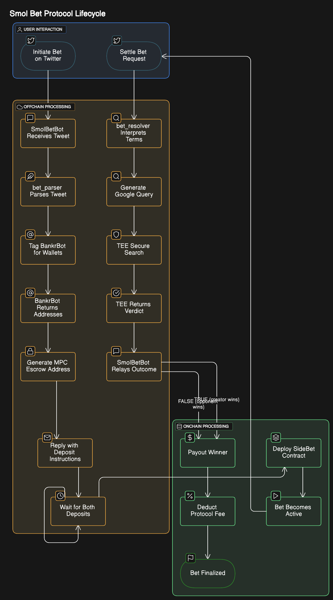

# 🧃 Smol Bet — Onchain Side Bet Protocol

Smol Bet is a lightweight, trust-minimized **peer-to-peer betting protocol** that turns informal wagers into enforceable onchain contracts.  
Users create bets by tagging friends on Twitter/X, staking ETH, and settling outcomes based on real-world events — resolved by **NEAR AI Agents + Google search**.

👉 **No oracles. No middlemen. Just verifiable stakes, AI-enforced outcomes, and automated payouts.**

---

## 🚀 Live Escrow Contracts

- [Base Sepolia — Escrow Factory](https://sepolia.basescan.org/address/0xfd5152d481cb46ea91aa317782e5963edc45a609)  
- [Aurora Testnet — Escrow Factory](https://explorer.testnet.aurora.dev/address/0x402BB0aD0B394EB38ebAA0a5c271eE01341e2AF0)  

---

## 🔁 Flow Overview



1. **Create a Bet**  
   Tag `@smol_bet` and an opponent on X, e.g.  
   ```
   @smol_bet @opponent I bet you 0.05 ETH that NEAR will be up 10% tomorrow.
   ```

2. **Parse the Bet** (via `bet_parser`)  
   - Extracts creator, opponent, stake amount, and bet terms.  
   - Returns structured JSON.  

3. **Escrow Setup**  
   - A unique **MPC escrow** address is generated.  
   - Bot replies with deposit instructions.  

4. **Stake & Lock**  
   - Both parties deposit ETH.  
   - Bet contract is deployed via factory.  
   - Bet becomes **active**.  

5. **Settlement Request**  
   - Either party tags the bot:  
   ```
   @smol_bet settle bet
   ```

6. **Resolution** (via `bet_resolver`)  
   - Interprets bet terms.  
   - Queries Google for the real-world outcome.  
   - Returns `TRUE` (creator wins) or `FALSE` (opponent wins).  

7. **Payout**  
   - Winner receives **99%** of the pool.  
   - **1% protocol fee** goes to treasury.  

---

## 🌍 Why Smol Bet?

Informal bets are everywhere — but they’re **unenforceable and often forgotten**.  

- Crypto price calls  
- Sports hot takes  
- Friendly challenges  

Smol Bet turns these into **onchain, social-native contracts** using the platforms people already use (like X).  
It’s for people who want **skin in the game** without relying on centralized bookies or clunky prediction markets.  

---

## 💸 Revenue Model

- **1% fee** on winning payouts funds the protocol treasury.  
- Scales with bet volume and stake size.  

**Future optional layers:**  
1. Sponsorships on high-visibility bets  
2. Premium features (anonymity, auto-settlement, group bets)  
3. DAO governance of treasury  

---

## 🛠 Components

| Component          | Description                                                                                                                                         |
| ------------------ | --------------------------------------------------------------------------------------------------------------------------------------------------- |
| `bet_parser`       | AI agent that extracts structured bet data from X posts → [Try it](https://app.near.ai/agents/ai-creator.near/bet-parser/latest)                    |
| `bet_resolver`     | AI agent that evaluates bet outcomes using NLP + Google → [Try it](https://app.near.ai/agents/ai-creator.near/Bet_Resolver/latest)                  |
| `@BankrBot`        | Helper bot to resolve wallet addresses from X handles — temporarily using @prakharojha4                                                             |
| `SideBet Contract` | Factory contract that deploys individual SideBets                                                                                                   |

---

## 🗺 Roadmap (Q4 2025)

- ✅ Escrow contracts live on **Aurora Testnet** + **Base Sepolia**  
- 🔄 End-to-end flow testing (create → stake → settle)  
- 🔬 R&D on **TEE-powered NEAR Shade Agent** for resolution  
- 📊 Leaderboard + bet tracking for early testers  
- 🛠 Backup/continuity: Resume bets after downtime  
- 🔮 Next: Prototype expansion to **Solana** + advanced AI arbitration  

---

## 📣 Call to Action

- **Test**: Try Smol Bet on Aurora/Base testnets.  
- **Contribute**: Help improve contracts, agents, and UX.  
- **Follow**: Join early experiments and help shape the protocol.  

📂 One-pager also available under `docs/` or root `README` for easy sharing.
